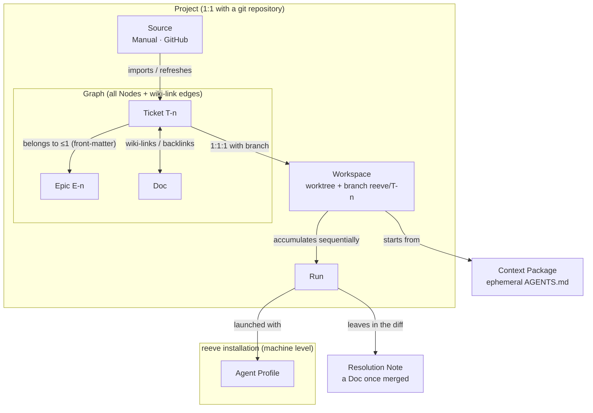
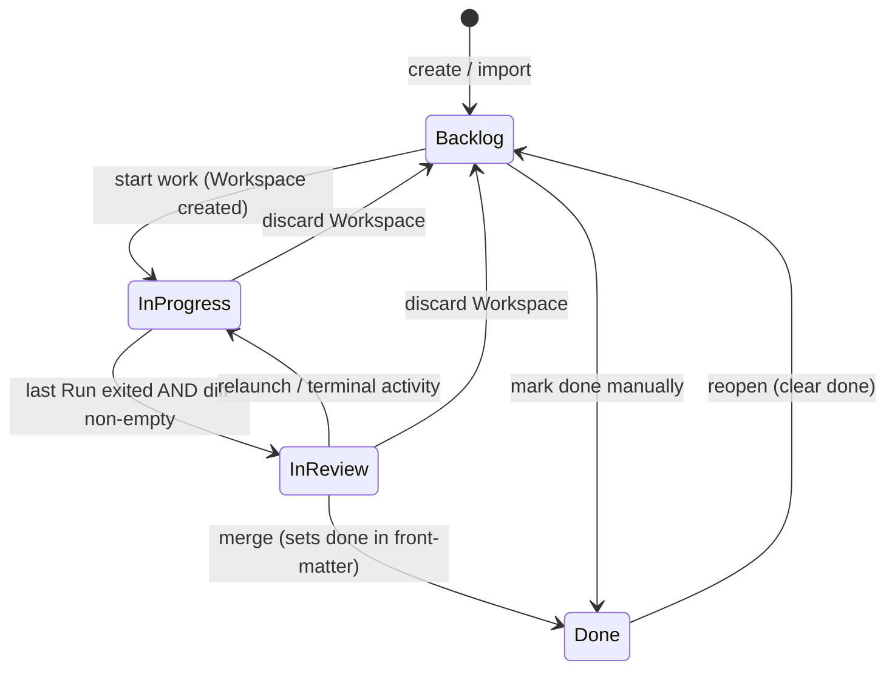

# 02 — Domain Model

**Status:** Signed off (2026-07-25)
**Ticket:** [Domain model: entities and ubiquitous language](https://github.com/jorgesolerrr/reeve/issues/8)
**Grounded in:** [01-requirements.md](./01-requirements.md) · [ADR-0001](../adr/0001-center-reeve-on-the-docs-memory-loop.md) · [ADR-0004](../adr/0004-write-back-rides-the-diff.md) · [ADR-0006](../adr/0006-app-shell-and-tech-stack.md)
**Glossary:** [CONTEXT.md](../../CONTEXT.md) is the canonical ubiquitous language; this document explains the model behind those terms. Where the two disagree, fix the disagreement — neither wins silently.

## Purpose & scope

This document fixes reeve's entities, their identities, relationships, and lifecycles. API design and architecture belong to the subsequent documents; this one decides *what things are*, not how they are served or stored — except where a storage fact (files, front-matter, git) **is** the domain, which in a files-first tool is often.

## Model overview



Two ownership levels exist and only two: the **installation** (machine) owns Agent Profiles; a **Project** owns everything else. There is no cross-Project anything — each Project is a closed context and wiki-links never cross it.

## Entities

### Project

A git repository registered in reeve, strictly 1:1 with the repository. One reeve instance manages N Projects, but each is a closed context: its own board, its own Graph, its own Sources and Workspaces. A multi-Project unified board may appear later as a *view*; it will not change this model.

**Project configuration** lives in `.reeve/config.json`, committed to the repository (single-user: git is the backup). It holds:

- the **Verify Command** — the Project's own way of checking itself (`npm test`, `cargo check`…), whose output accompanies the diff at review (FR-5.1);
- the **default Agent Profile**, referenced by name (profiles themselves are machine-level);
- Source configuration (see [Source](#source));
- the **auto-commit flag** (see [Commit policy](#commit-policy));
- the **base branch** (`baseBranch`) — the branch Workspaces are cut from and merged into; resolved at Project registration (`origin/HEAD`, fallback to the current branch), user-editable. *(Amended by 07-lld-workspaces.)*

### Node

Anything addressable in a Project's Graph: a file that can receive wiki-links and appear in backlinks. Three kinds exist in v1 — **Ticket**, **Epic**, **Doc**. Two name-like properties, deliberately distinct:

- **Name** — the filename without extension. This is the Node's identity and what wiki-links store. For Tickets and Epics the name *is* the id (`T-42`, `E-7`).
- **Title** — what humans read (front-matter `title` or first H1). The UI displays titles everywhere — board cards, backlinks panel, rendered wiki-links (`[[T-42]]` renders as its title with the id as a secondary badge). Humans never read raw ids; machines never depend on titles.

Renaming a title is free and breaks nothing. Renaming a *file* is a real rename and can break links (see [Link resolution](#wiki-link-resolution)).

### Graph

A Project's memory: every Node in the repository plus the wiki-link edges between them. The **whole repository** participates, respecting `.gitignore` — design docs, READMEs, and reeve-created files are all Nodes; there is no blessed folder and no silo. Only Markdown files contribute *outgoing* edges (FR-2.5); Excalidraw and HTML files are linkable leaf Nodes.

The link index is a rebuildable cache (SQLite, per ADR-0006) living **outside** the repository in the machine's app-data directory. Nothing in the cache is truth; deleting it costs a re-index, never data.

### Ticket

A unit of work: a Markdown Node whose front-matter carries ticket metadata. The board is a view over Tickets, not a separate store.

**Identity.** Per-Project sequential id with the `T-` prefix (`T-1`, `T-2`…), assigned by reeve at creation or import, never reused, independent of any source-side number (a GitHub issue's `#123` is source data, not identity). The id is stable and branch-name-safe (ADR-0006); the file is `.reeve/tickets/T-42.md`; the branch is `reeve/T-42`.

**Front-matter carries** (exhaustively — anything else is derived):

- `title`
- `done` (+ date) — the *only* stored board state
- `epic` — optional, the id of the one Epic this Ticket belongs to
- source reference — kind + coordinates + URL for imported Tickets; absent for manual ones

**Body.** For manual Tickets, free Markdown. For imported Tickets, the body contains a [Materialized Region](#materialized-region) plus free local content around it.

### Epic

The one-level grouping of Tickets (FR-1.4): a Markdown Node describing a feature or milestone, id `E-<n>`, file `.reeve/epics/E-7.md`. A Ticket belongs to at most one Epic, declared in the *Ticket's* front-matter (membership points upward; the Epic file stays clean and gets the inverse view for free via backlinks-style queries). Epics never nest and never belong to other Epics — that is exactly "one level". The board can group by Epic; being a Node, an Epic can be wiki-linked and pulled into a Context Package like any other context.

### Doc

A knowledge Node that is not a Ticket or Epic: Markdown (viewable, editable, creatable in-app), Excalidraw (embedded editor), or HTML (view-only, sandboxed — NFR-2). Any other file type is not a Node; reeve opens it with the system default application. A merged Resolution Note is an ordinary Markdown Doc.

### Source

An origin of work configured in a Project. The model is "a Project has N Sources"; **v1 policy** caps it at two:

- **Manual** — always present, implicit, not configured. Manual Tickets carry no source reference.
- **GitHub** — at most one per Project, defaulting to the Project repository's own issues (auto-detected from the `origin` remote, editable). Contract per FR-1.2: import, refresh on demand, offer-to-close on Done, never write content to the remote.

Adding a source kind (Linear next) is new code behind the same `TicketSource` seam plus registration — the N-Sources shape is already the model, so no remodeling.

### Materialized Region

Import **materializes** the remote issue into the Ticket body: a marker-delimited section (HTML comments) owned by the Source, containing title, body, **and comments**, copied verbatim. Refresh rewrites the region wholesale; everything outside it — the user's notes, wiki-links, agent additions — is local and refresh never touches it. Consequence: the agent reads the full issue, discussion included, as a plain local file — no remote fetch in the loop, deterministic by construction (ADR-0003).

### Workspace

The isolated place where a Ticket's work happens: a git worktree on the Ticket's own branch `reeve/T-<n>` (the v1 `WorkspaceProvider` implementation). Strictly **1:1:1 Ticket ↔ Workspace ↔ branch**; a Ticket has at most one live Workspace; parallelism is across Tickets, never within one. Nothing about a Workspace is stored that git cannot re-derive (ADR-0006): the branch name encodes the Ticket, and existence is checked against git, so state cannot desync.

A Workspace ends in exactly one of: **merge** (into the user's chosen base branch), **push** (branch to remote; PRs happen outside reeve), or **discard** (Windows-safe destroy sequence; no residue).

### Run

One process launched inside a Workspace: which Agent Profile (for agent Runs), when started, how the process exited. A Run has a **kind** — `agent` (launch/relaunch of the profile's agent), `terminal` (manual PTY passthrough), or `verify` (the Project's Verify Command; its exit code is the pass/fail signal accompanying the diff, FR-5.1 — amended at the API-surface ticket). A Workspace accumulates Runs **sequentially**, never concurrently. Runs are operational metadata in the rebuildable cache, **not Nodes**; each Run's raw PTY log is kept as a plain inspectable file outside the Graph.

**Deliberate thesis refinement** (signed at this ticket): ADR-0001's "agent transcripts join the graph" is realized in v1 by the **Resolution Note**, not by raw transcripts. Raw PTY output is huge, noisy, and would poison deterministic context assembly; distillation would require an LLM in the retrieval path, which ADR-0003 forbids. Transcript-as-Node is revisited post-v1 if dogfooding demands it.

### Agent Profile

A machine-level definition of how to launch an agent: name, command, args, env references (names only, never values — NFR-2), prompt delivery, completion timeout. Profiles belong to the reeve installation (global JSON config, editable), because agent CLIs are machine tools, not repo properties. Each Project picks a default profile by name; a Run may override it.

### Context Package

The deterministic payload a Run starts from (FR-3.1): from the Ticket node, follow outgoing links and backlinks 1–2 hops, rank by hop distance, cut to the token budget, write into the Workspace as `AGENTS.md` together with a title/path index of the Graph. `AGENTS.md` also fixes the **Resolution Note convention** — where to write it and what front-matter links it to the Ticket (FR-5.3) — so the write-back instruction travels inside the package itself, agent-agnostically. Ephemeral and derived: regenerated per Run, previewable and adjustable per-launch (FR-3.2), never a Node, never persisted as truth.

### Resolution Note

The Markdown note an agent writes as part of its diff, following the `AGENTS.md` convention, at `.reeve/notes/`. It rides the same diff as the code; **merging is the approval** (ADR-0004) — on merge it becomes a Doc in the Graph, linked to its Ticket, and the next Run starts knowing more. This is the loop closing, and it is the only path by which agent output enters the Graph.

## Ticket lifecycle



**Only `done` is stored** (front-matter, with date). Everything else is derived from real state and cannot desync:

| State | Rule |
|---|---|
| **Backlog** | Not done, and no live Workspace. The default by elimination. |
| **In Progress** | A live Workspace exists. |
| **In Review** | A live Workspace exists, the last Run's process has exited, and the diff against base is non-empty. Pure derivation — no "request review" act. Relaunching or touching the terminal returns the Ticket to In Progress by the same rule. |
| **Done** | `done: true` in front-matter. Set by reeve as part of merge, or by hand (work can resolve without code). On Done of an imported Ticket, reeve **offers** to close the remote issue (FR-1.2). |

Discard returns the Ticket to Backlog — a failed experiment leaves no residue, including no state residue.

## Wiki-link resolution

Deterministic, four rules, no fuzzy matching:

1. A link target is a **Node name**: `[[01-requirements]]` resolves to the file `01-requirements.md` (extension-less basename).
2. **Tickets and Epics are named by id** — file `T-42.md`, title in front-matter — so `[[T-42]]` is simultaneously id-link and filename-link. One rule, and title renames never break links.
3. **Ambiguity is a visible error, never a guess.** Duplicate basenames make the bare link ambiguous; it is flagged (like broken links in the FR-5.3 merge check) and disambiguated with a path: `[[docs/api]]`.
4. **File renames can break links.** The merge-time check detects and warns (FR-5.3); automatic rename-refactoring is out of v1.

Display rule: links *store* names; the UI *renders* titles (see [Node](#node)).

## Repository layout

Committed, at the repository root:

```
.reeve/
├── config.json      # Project configuration
├── counters.json    # id counters — never-reuse is not derivable (added by 09-lld-sources)
├── tickets/         # T-1.md, T-2.md, …
├── epics/           # E-1.md, …
└── notes/           # Resolution Notes (arrive via merged diffs)
```

Docs live wherever the user keeps them — the whole repository is the Graph. The index cache lives outside the repository (app data) and is disposable.

## Commit policy

Reeve's structural acts (create/import a Ticket, refresh a Materialized Region, mark Done) dirty the working tree of the base branch. Behavior is governed by a **per-Project flag** in `config.json`:

- **`autoCommit: true` (default)** — reeve commits its own acts on the base branch, small and conventionally labelled (`reeve: import T-43`, `reeve: T-42 done`), touching **only files under `.reeve/`**, never anything else.
- **`autoCommit: false`** — reeve never commits; graph changes sit in the working tree and the user commits them within their own flow.

In both modes, the user's manual edits to Docs are the user's to commit — reeve auto-commits only its own structural acts, never content authorship.

## Explicit non-entities

Ruled out of the v1 model, on purpose:

- **Review** — an activity over Workspace state (diff + Verify Command output), not a stored object. Its outcomes are merge, push, discard. If inline diff comments arrive (deferred to the loop/hook event model), that feature decides whether it needs an entity.
- **Transcript** — see [Run](#run); the Resolution Note is the Run's durable contribution.
- **Loop / Hook** — out of v1 entirely (ADR-0005); will be modeled by its own effort.
- **User / Account** — single-user local-first; there is no user entity anywhere.

## Sign-off

- [x] Signed off by Jorge Soler — 2026-07-25
